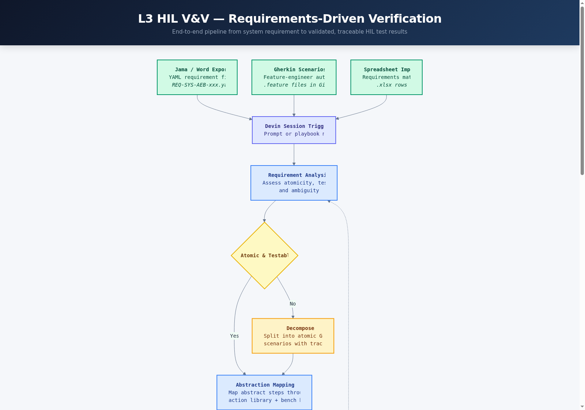

# L3 HIL Verification Demo — Requirements-Driven V&V


## Verification Workflow

> End-to-end pipeline from system-level requirement to validated, traceable HIL test results.
> For the full interactive version, see [`docs/flowchart.html`](docs/flowchart.html).



## What this demo shows

Devin takes a system-level (L3) requirement — from a Jama export, a spreadsheet
row, or a Gherkin feature file — assesses whether it is atomic, testable, and
unambiguous, decomposes compound requirements into multiple atomic Gherkin
scenarios while preserving traceability, maps abstract test steps through an
OEM's bench-boundary abstraction library into concrete HIL signals, generates
executable test artifacts, runs them, and produces a traceability report linking
every result back to the original requirement.

## What Devin does live

The presenter prompts a fresh Devin session to process a compound system
requirement (`REQ-SYS-AEB-002`). Inside the session, Devin:

1. Ingests the requirement and runs quality analysis — detects it is compound
   (multiple "shall" clauses for deceleration, warning, haptic, and ramp).
2. Decomposes it into atomic Gherkin scenarios, each independently testable,
   with traceability tags back to the parent requirement.
3. Maps abstract steps ("set ignition on", "host vehicle travelling at 40 kph")
   through the action library + bench-boundary config for `bench_beta` (partial
   bench: brake + ADAS physical, radar/camera/cluster simulated).
4. Generates executable test scripts — ECU-TEST style Python, no hard-coded CAN
   IDs — into `test_artifacts/generated/`.
5. Executes tests against the replay harness (mock HIL bench), collecting metrics
   and pass/fail verdicts.
6. Checks existing scenarios in `scenarios/existing/` for impact from the
   requirement change.
7. Produces a traceability report and opens a PR with all generated artifacts.

Throughout, the V&V dashboard at `http://localhost:5001/` (visible via the Devin
webapp's Browser tab) shows pipeline progress and the traceability matrix.

## How the demo runs

| Step | What the presenter does | What the audience sees |
|---|---|---|
| 1 | Walk through the three requirement formats in `requirements/sources/` — highlight `REQ-SYS-AEB-002` as compound | YAML, Gherkin, and spreadsheet inputs; compound requirement with four bundled conditions |
| 2 | Prompt Devin: *"Analyze and process REQ-SYS-AEB-002 end-to-end"* | Devin starts — dashboard stages turn green one by one |
| 3 | Narrate the decomposition on the dashboard | Compound requirement splits into atomic Gherkin scenarios |
| 4 | Show the abstraction mapping — abstract steps resolving to concrete signals via `bench_beta` | Signal routing: physical ECUs on real bus, simulated ECUs through plant model |
| 5 | Watch test execution and results | Pass/fail verdicts with metrics (response time, deceleration profile) |
| 6 | Open the PR Devin produced | Generated `.feature` files, test scripts, traceability report — all reviewable |

> **HIL bench substitute called out.** Real dSPACE SCALEXIO hardware is
> unreachable from a Devin VM, so test execution replays pre-captured JSON
> traces. The replay produces the same signal data a real bench would, so
> pass/fail analysis and traceability reporting are identical.

### Local development

```bash
uv sync                                      # Install dependencies
uv run python -m harness.analyzer requirements/sources/REQ-SYS-AEB-002.yaml  # Analyze a requirement
uv run pytest -q                             # Run unit tests
uv run uvicorn dashboard.app:app --port 5001 # Launch dashboard
```

## Repo layout

```
docs/
  IMPLEMENTATION_PLAN.md          # Why every choice — read this first
  flowchart.html / flowchart.png  # Pipeline flowchart

requirements/sources/
  REQ-SYS-AEB-001.yaml           # Atomic requirement (Jama-style)
  REQ-SYS-AEB-002.yaml           # Compound requirement (demo decomposition target)
  REQ-SYS-AEB-003.feature        # Gherkin-authored requirement
  requirements_matrix.xlsx        # Spreadsheet import format

scenarios/
  existing/aeb_basic_stop.feature # Pre-existing scenario (impact analysis target)
  generated/                      # Devin fills this live

abstraction/
  action_library.yaml             # Abstract actions → signal operations
  bench_boundary.yaml             # ECU topology per bench
  signal_dictionary.yaml          # Signal → CAN/LIN address + scaling

bench_configs/
  bench_alpha.json                # Full bench (all ECUs physical)
  bench_beta.json                 # Partial bench (core ECUs physical, rest simulated)

harness/                          # V&V pipeline modules
  analyzer.py                     # Requirement quality assessment
  decomposer.py                   # Compound → atomic Gherkin scenarios
  mapper.py                       # Abstract steps → bench signals
  generator.py                    # Scenario → executable test script
  executor.py                     # Mock HIL test executor (replay harness)
  tracer.py                       # Traceability matrix builder

dashboard/                        # FastAPI V&V dashboard on :5001
test_artifacts/generated/         # Devin fills this live
traces/                           # Pre-captured HIL traces for replay
tests/                            # Unit tests

.github/workflows/ci.yml          # Lint + typecheck + test
DEMO_NOTES.md                     # Presenter cheat sheet
```

## Key concepts

| Term | Meaning |
|---|---|
| L3 testing | System-level verification — validates requirements across multiple ECUs, not a single ECU's code |
| Bench boundary | Defines which ECUs are physical hardware vs simulated on a given HIL bench |
| Abstraction library | Maps high-level actions ("set ignition on") to concrete signal writes (CAN ID 0x130, bit 0) |
| Compound requirement | A requirement that bundles multiple independently testable conditions — must be decomposed before test generation |
| Atomic requirement | A requirement with a single testable condition — ready for direct test generation |
| Gherkin scenario | A BDD specification using Given/When/Then syntax — the target format for all decomposed requirements |
| Traceability | Linking every test result back through the generated scenario to the original requirement |
| ASIL | Automotive Safety Integrity Level (ISO 26262) — A through D, determines test rigor |
| ECU-TEST | TraceTronic's test automation tool — generated test scripts follow its Python-based pattern |
| ASAM XIL | Industry standard API for HIL/SIL/MIL test bench communication — abstraction layer is modeled on its MAPort concept |
| Replay harness | Mock HIL executor that replays pre-captured trace data — "appears runnable" substitute for real hardware |
